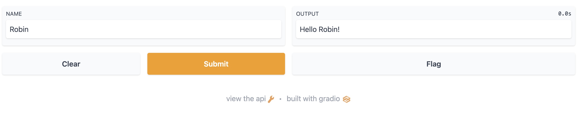

# gradio-docker-demo
Demo deploy gradio app using docker. Ref https://github.com/gradio-app/gradio/issues/24

```
docker build -t gradio-demo .

docker run -p 7860:7860 gradio-demo
```

Go to [http://localhost:7860/](http://localhost:7860/)

<p align="center">

</p>
